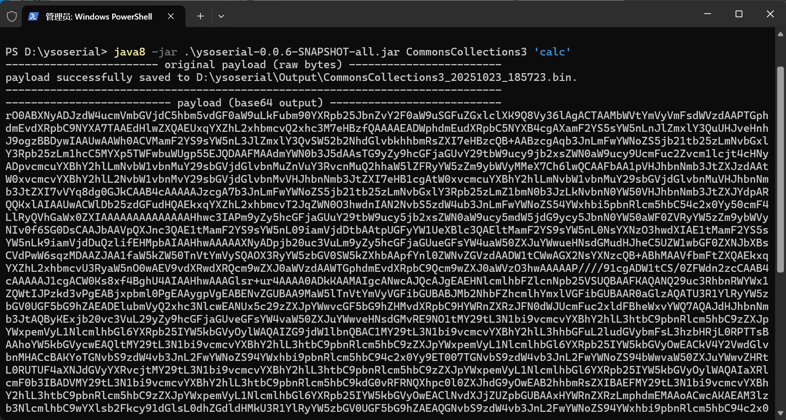

# ysoserial_err0r

一个自己简单魔改的ysoserial，支持rawbytes输出和base64编码输出

同时新增了部分payload，例如jackson、fastjson1、fastjson2原生反序列化等

用法：

```shell
java -jar ysoserial.jar [PayloadType] 'Command'
```


使用例：



jar包编译环境为java8，请使用java8打开


新增的gadget如下

| payload                       | description                        | dependencies                        | tips                                      |
| ----------------------------- | ---------------------------------- | ----------------------------------- | ----------------------------------------- |
| CommonsCollections3SpringEcho | 用cc3加载spring controller内存马   | commons-collections3.2.1 spring依赖 | 使用该gadget只需在command处输入任意命令。 |
| jackson                       | jackson依赖，使用proxy代理的稳定版 | Jackson-databind:2.1.2              |                                           |
| fastjson1                     | fastjson原生反序列化               | fastjson <=1.2.83                   |                                           |
| fastjson2                     | fastjson2原生反序列化              | fastjson2.x                         |                                           |

